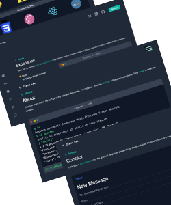
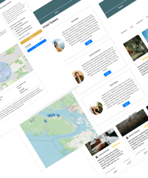

<h1 align="center"> Hi, I'm Claire! 👋</h1>

 
 
 

I am currently enrolled in the Computer Programming and Analysis program at George Brown College. With a passion for art and craft, I enjoy integrating simple design with intricate functionality, a skill I am actively refining. My current learning focus is on enhancing my proficiency in Object-Oriented Programming with Java and Python. I am eager to explore new opportunities and continue advancing my capabilities.

## 🥕 Projects Preview:

<table>
  <!-- 1st row -->
  <tr>
    <td width="50%" valign="top">
      <h3 align="left" style="padding-left: 5rem;">Portfolio v2</h3>
       
      

      
      

       
        <a href="https://www.jclairelee.com" target="_blank">Demo</a>     
        <strong>React | Tailwind CSS | Framer Motion | EmailJS</strong>   
        • Terminal UI and animations in About/Experience page  
        • IOS Email UI in Contact Page  
        • Clickable icons to display details on Skills page 
        • Portfolio and Landing Page
      

    </td>
    <td width="50%" valign="top">
      <h3 align="center">Island Tasker</h3>
       
       

      
      

       
       

        <a href="https://islandtasker.netlify.app/" target="_blank">Demo</a> | <a href="https://github.com/jclairelee/IslandTasker" target="_blank">Repo</a>  
       

        <strong>Address Open Data | React | Firebase | Leaflet | SASS</strong>   
        • Location-based connecting service  
        • Geo-coordinate conversion using Proj4  
        • Calculate distance between two coordinates using Geolib  
        • Stripe for payment service
        

      

    </td>

  </tr>
  
  <!-- 2nd row -->
  <tr>
    <td width="50%" valign="top">
      <h3 align="left" style="padding-left: 5rem;">Languly</h3>
       
      
       
      

        <a href="https://github.com/jclairelee/languly" target="_blank">Frontend Repo</a> |
        <a href="https://github.com/jclairelee/Languly-api" target="_blank">Backend Repo</a> |
        <a href="https://languly-dash.netlify.app" target="_blank">Demo</a>  
        <strong>React | WebRTC | Node.js | Socket.io | SASS | MongoDB</strong>    
        • Video call page  
        • Login / Logout  
        • Friends invitation
      

    </td>
    <td width="50%" valign="top">
      <h3 align="center">Liv Inspiration</h3>
       
      

      
      

       
       

        <a href="https://github.com/jclairelee/liv_client" target="_blank">FrontEnd Repo</a> | <a href="https://github.com/jclairelee/liv_api" target="_blank">Backend Repo</a> | <a href="https://liv-inspiration.netlify.app" target="_blank">Demo</a>  
         

        <strong>React | Vite | SASS | Node.js | Multer | MySQL</strong>    
        • JWT authentication  
        • CRUD operations for comments and blog posts  
        • Data communication
      

      

    </td>
  </tr>
</table>

## Techology

	
	
	
	
	
	
	
	
	
	
	
	
	
	
	
	
	

 
<!-- 
 -->

<!-- https://marwin1991.github.io/profile-technology-icons/ -->

## 🏆 GitHub Trophies

---

## Feedback

If you have any feedback, please reach out to us at jclairelee2@gmail.com
